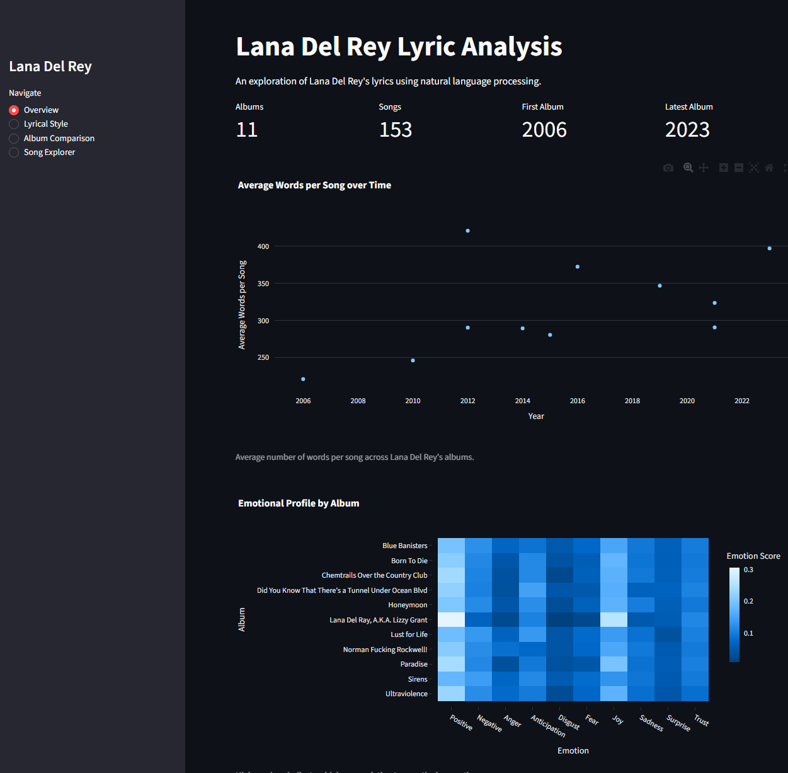
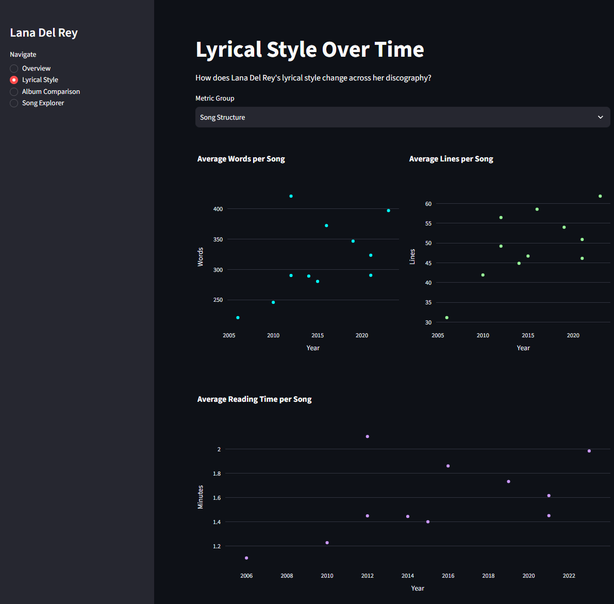
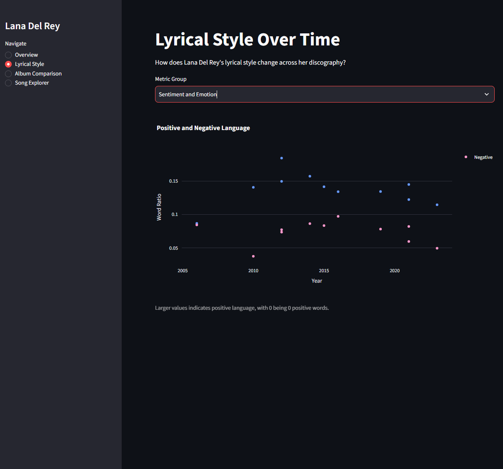
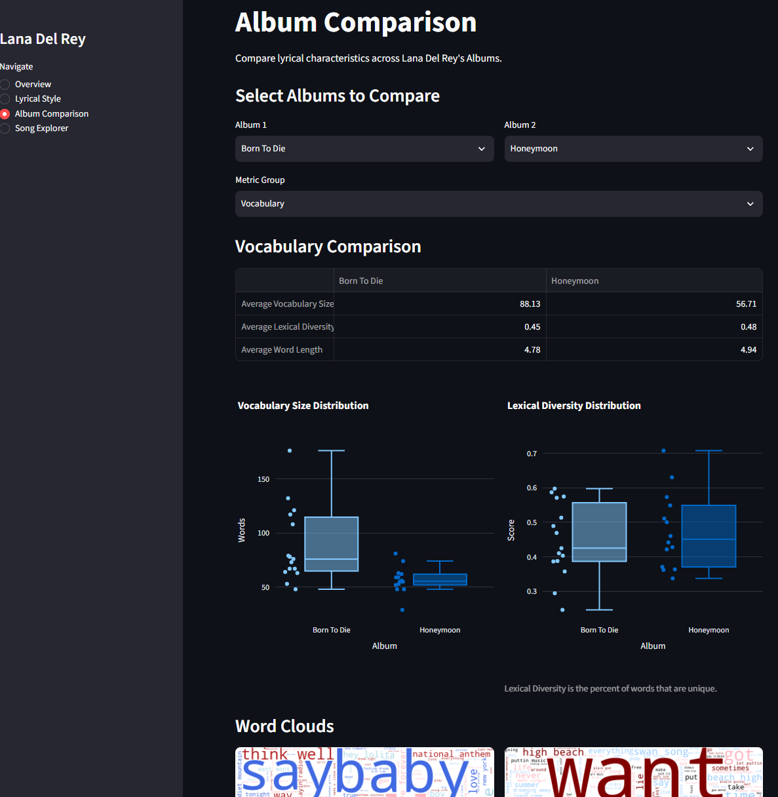
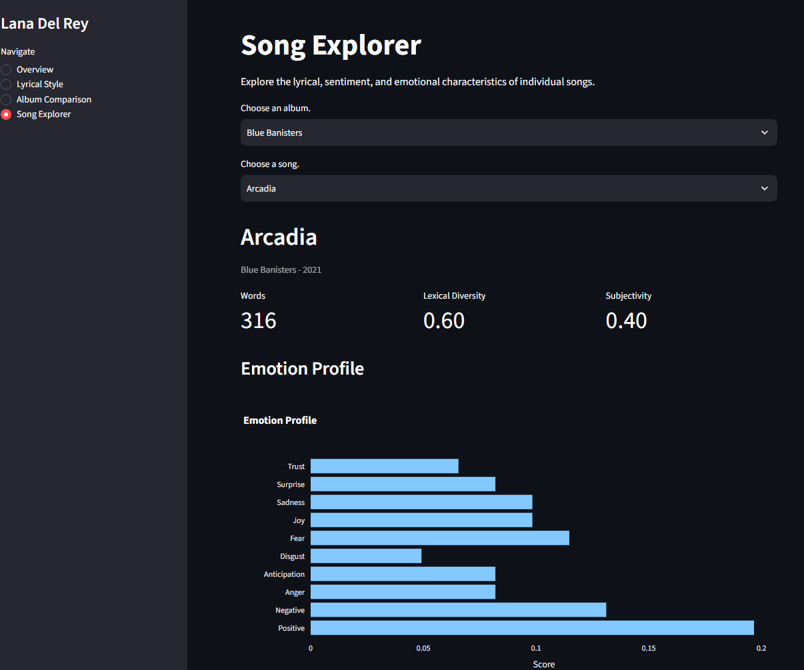
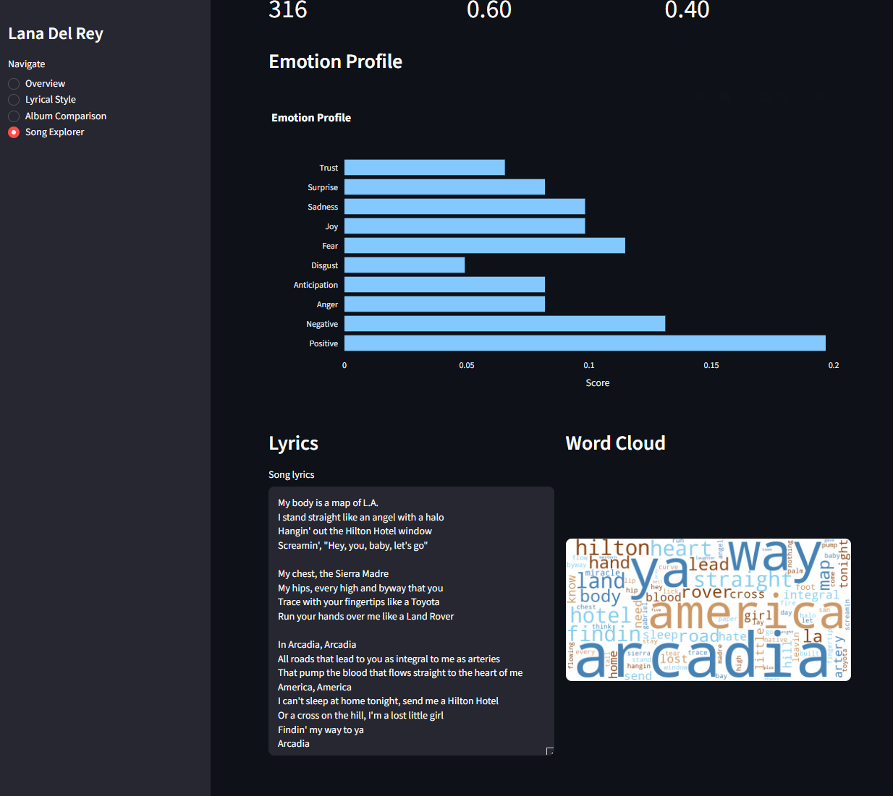

# Lana Del Rey Lyric Analyzer

## Overview
The Lana Del Rey Lyric Analyzer explores Lana's lyrics across her albums using natural language processing (NLP). 
and data analysis. Lyrics are preprocessed and cleaned and preprocessed before a variety of statistical and linguistic 
metrics are calculated. 

The project examines metrics such as word count, unique words, lexical diversity, reading time, readability, sentiment, 
and emotional profile. The results are presented through interactive visualizations and a Streamlit dashboard featuring 
an album comparison page and a song explorer.

## Research Questions
How has Lana Del Rey's lyrical structure changed over time?   
how has the diversity and complexity of her vocabulary changed over time?   
How to albums compare?

## Features
**Album Comparison** - Compare albums across lyrical and NLP metrics, including word count, vocabulary size, lexical 
diversity, readability, sentiment, and emotional profile.

**Song Explorer** - Explore individual songs and view their lyrics and NLP metrics.

**Lyrics Analysis** - Calculate word count, unique words, lexical diversity, line count, reading time, and readability 
metrics.

**Sentiment Analysis** - Analyze sentiment polarity and subjectivity using NLP techniques.

**Emotion Analysis** - Examine the presence of emotions including anger, anticipation, digust, fear, 
joy, sadness, surprise, and trust.

**Interactive Visualizations** - Explore lyrical patterns and differences through interactive charts and visualizations.

**Album-Specific Styling** - Visualizations use custom color palettes inspired by each album.

## Data
Lyrics were collectedfrom the [Lana Del Rey Wiki](https://lanadelrey.fandom.com/wiki/Lana_Del_Rey_wiki) and compiled 
into a CSV dataset. The dataset contains album, year, song, and lyrics.  
  
The lyrics were then cleaned and preprocessed for analysis and natural language processeing.

## NLP & Analysis

### Text Processing
Basic text processing is done first to normalize lyrics. This includes converting text to lowercase, removing 
annotations and excess whitespace, expanding contractions, and removing punctuation.

Additional processing prepares the lyrics for NLP analysis. This includes tokenizing the lyrics into individual words, 
removing stopwords (such as "the" and "and"), and lemmatizing words so that related forms such as "love" and "loved" 
are treated as the same word.

Two versions of the cleaned lyrics are maintained: a basic cleaned version use for general feature calculations and an 
NLP-cleaned version used for vocabulary, sentiment, emotion, and readability analysis.

### Metrics

#### Basic Lyrics Metrics

* Word Count
* Unique Words
* Line Count
* Reading Time

#### Vocabulary
* Vocabulary Size
* Lexical Diversity
* Word Length

#### Readability
* Flesch Reading Ease
* Flesch-Kincaid Grade Level
* Gunning Fog Index

#### Sentiment
* Sentiment Polarity
* Subjectivity
* Positive Word Ratio
* Negative Word Ratio

#### Emotional Profile
* NRC emotion categories: anger, anticipation, digust, fear, joy, sadness, surprise, and trust

## Dashboard

### Overview

### Lyrical Style

### Album Comparison

### Song Explorer

## Visualizations

### Sentiment Analysis

### Emotion Analysis

## Streamlit Dashboard

## Key Findings

## Technologies

## Project Structure

## Installation & Usage

## Future Improvements
* Expand sentiment analysis and visualization
* TF-IDF to find words that descrive each album
* Implement topic modeling using Latent Dirichlet Allocation (LDA)
* Add artist-to-artist comparisons

## Author